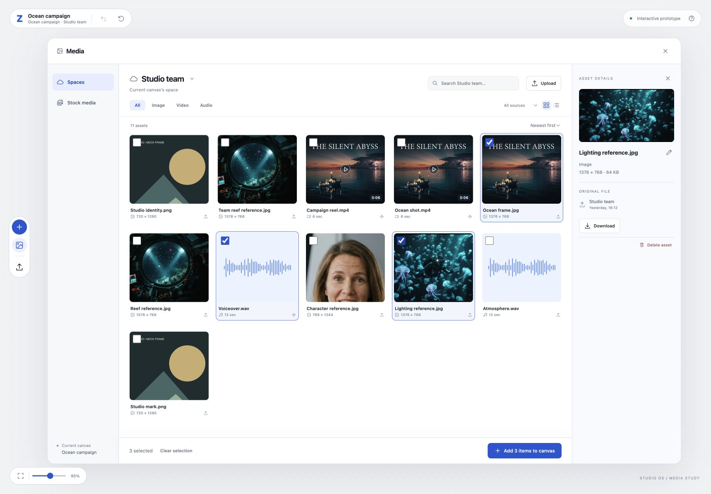

# Media browser design reference

This folder contains the approved basic Media browser prototype for [issue #11](https://github.com/thaolhcx/zcanvas/issues/11). It is a standalone design reference, not the production frontend.



## Open the prototype

Download `index.html` and open it in a browser. Images, video and audio samples are embedded in the HTML. No build step or API is required.

You can also serve this folder locally:

```sh
python3 -m http.server 4181 --bind 127.0.0.1 --directory docs/design/media-browser
```

Then open http://127.0.0.1:4181/. Port 4181 avoids the original design session on port 4180.

## Agreed design

Read [design-notes.md](design-notes.md) for the approved flows and [implementation-scope.md](implementation-scope.md) for the later backend scope update.

The prototype includes Spaces, sample Stock media, search, filters, grid/list views, file previews, multi-selection, batch insertion and Undo. The details panel has one Rename control and only shows canvas usage when there are related nodes.

Generated prompt/reference metadata and hover previews are agreed requirements in the notes, but they are not yet in this HTML. References will use file names as plain text.

The film experiment is not included. Characters, Scenes and Props are outside this release.

## Limits

- Data and actions are local to the browser session. Reloading resets the demo.
- Uploads use temporary browser URLs. They do not reach the backend.
- Spaces and stock files are samples, not real memberships or a connected stock service.
- Sample media is for interface review. The audio is a test sample and the short video does not prove preview quality with real moving footage.
- This HTML does not prove access control, durable storage, semantic search or large-list performance.
- Its inline script is prototype code. Implement the product using the existing React, Graph API and server contracts.

The screenshot records the approved multi-selection and details layout. It is not evidence that issue #11 is complete.
