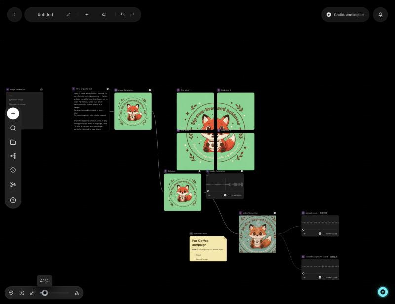
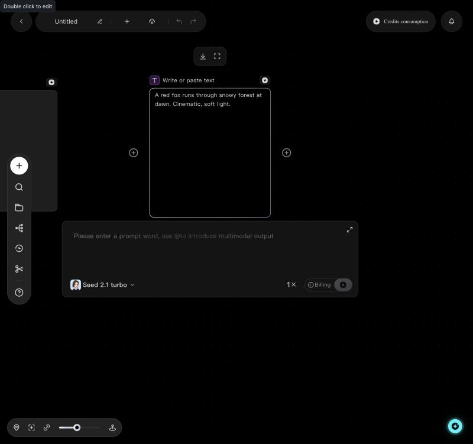
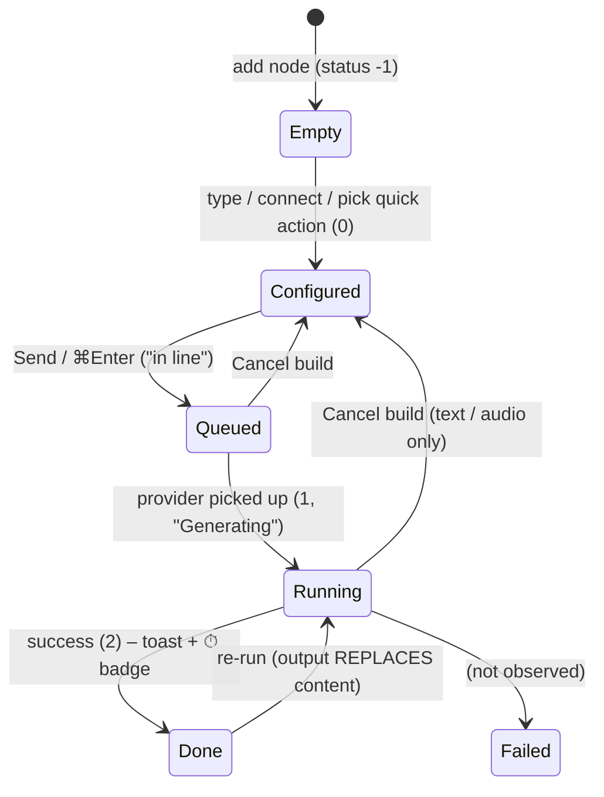

# BytePlus Lumina — node study for zcanvas

Hands-on teardown of five Lumina canvas nodes: **Text, Image, Video, Audio and Sticky Note**. Use it to plan the matching zcanvas nodes.

| | |
|---|---|
| Studied | 2026-10-02, live product at `ai.byteplus.com/lumina/en/canvas/…` (English UI) |
| Method | Used every control by hand. Read node and edge data straight from Lumina's React Flow store. Ran one real generation per node type. |
| Credits spent | ≈ 48 credits: text ≈0.01, image 9, upscale 3, TTS ≈0.3, 4 s video ≈36, audio extract ≈0.03 |
| Evidence | 86 screenshots in [`img/`](img/). Raw notes, schemas and prices in [`_raw-notes.md`](_raw-notes.md). |
| Not tested | File upload (it opens the OS picker), failure/error state (I couldn't trigger one), Video Splice / Director's Desk / Storyboard / Script Planning (out of scope) |

---

## TL;DR — what matters for zcanvas

1. **Lumina is also React Flow.** Its node model maps almost one-to-one onto ours. Every generative node shares one shell: header → body (preview/result) → a prompt panel that appears under the node when selected → a tool bar above the node when selected.
2. **One generic handle per side.** It is not one handle per port. The node's model decides what it accepts. Connected inputs show up as **removable chips** in the prompt panel, and removing a chip deletes the edge.
3. **Parameters are 100% schema-driven per model.** Each model ships a `schema[]` of fields. The UI splits them into *inline chips* (size / duration / camera / panorama) and an *Advanced Parameters* popover. Switching model re-renders the chips, filters the mode tabs, and can raise validation ("Please modify the duration.").
4. **Modes are tabs bound to model capabilities.** Video has end to end frame, omnipotent reference, video editing and video extension. Audio has ta2a, text-to-audio, audio reference and image-to-audio. Unsupported tabs are hidden or disabled. Models that can't take the connected input are greyed out, and Lumina **auto-switches** to one that can, with a tooltip.
5. **A generation replaces the node's content.** The node keeps no version history. History lives in a global **Creative history** gallery.
6. **Tools are non-destructive and create a new connected node.** This covers Enhance/Upscale, audio extraction, grid split, Image-to-image, Elaborate and so on. Some tools spawn a temporary node, then replace it with result nodes linked by **dashed "virtual" lineage edges**.
7. **Quick actions on an empty node are mini-templates.** "Elaborate" adds an upstream LLM node with a preset system prompt. "Ask about an image" adds an empty upstream Image node and presets this node's system prompt.
8. **The prompt editor is a rich editor (Slate).** It has `@` mentions of upstream nodes and inline **color tokens** (`● #7BE188`). It also has an expand-to-fullscreen mode.
9. **Cost is visible everywhere.** Each node has a credits badge. The Billing chip hover shows a price table for the chosen model and options. A global "Generating n/m" pill shows progress. The finish toast shows elapsed time, and the header keeps a `⏱ 54.9s` badge.
10. **The sticky note is a plain Markdown card.** It's yellow, has no AI and no outputs, and offers edit/preview fullscreen. It can be attached from a Text output, but nothing flows into it.

---

## 1. Canvas context (only what the nodes depend on)



*Overview after the test run. Text → Image → Enhance feeds both Audio and Video. The video's extracted vocals and background audio hang off dashed edges. Two stickies and the quick-action subgraphs are also visible.*

**Ways to add a node.** All of them open the same *Add Node* menu, filtered when there's a connection context.

| Entry point | Behaviour | Shot |
|---|---|---|
| Left rail **+** | Pinned panel with every node type and a one-line description. It's a toggle (+ / ×) and stays open after adding. The new node lands at the **viewport centre with no overlap avoidance**. | [01](img/01-add-node-menu.jpg) |
| Double-click empty canvas | Same menu, at the cursor. | [04](img/04-canvas-doubleclick-add-node-menu.jpg) |
| Click a node's output **+** | Menu filtered to nodes that accept this output. The new node is placed to the right and connected. | [24](img/24-text-output-plus-add-downstream-menu.jpg), [54](img/54-image-output-plus-downstream-menu.jpg) |
| Drag from output handle to empty space | A pending wire stays visible and the filtered menu opens at the drop point. The node is created there. | [55](img/55-drag-handle-to-empty-add-node-menu.jpg) |
| Drag from **input** handle to empty space | **Upstream** menu (for an Image input: Text / Image / Audio). | [56](img/56-drag-input-handle-upstream-menu.jpg) |

**Menu descriptions** (these work well as copy for our palette):

| Node | Description |
|---|---|
| Text | Scripts, advertising words, brand copy |
| Image | Promotional graphics, posters, covers |
| Audio | Music, dubbing, sound effects |
| Video | Promotion of video, animation, film |
| Sticky Notes | Logging with Markdown |

**Other canvas furniture that touches nodes:**
- Pane right-click: *Add Group · Paste ⌘V · Smart Layout · Node Search* ([05](img/05-canvas-pane-context-menu.jpg)).
- Bottom bar: *Canvas Minimap · Grid Adsorption (snap) · Hide Node Connections · zoom slider (% tooltip) · Quick Focus*.
- Scrolling **pans**. ⌘ + scroll or the slider zooms.
- Shortcuts ([03](img/03-canvas-shortcuts.jpg)):

  | Shortcut | Action |
  |---|---|
  | Space + drag | Pan |
  | ⌘Enter | **Generate** |
  | ⌫ | Delete |
  | **Shift + click edge** | Delete connection |
  | F | Quick Focus |
  | ⌘C / ⌘V | Copy / paste |
  | ⌘Z / ⌘⇧Z | Undo / redo |
  | ⌘F | Node search |
- **Creative history** (left rail): a gallery of every generated asset with tabs All / Image / Video / Audio, batch select, grid toggle, sort by time, filter, and search by node name. Grouped by day ([06](img/06-creative-history-panel.jpg)). This is where old versions live.
- Autosave: a cloud icon in the top bar. A reload restored every node and result.

---

## 2. Shared anatomy of a generative node (Text / Image / Video / Audio)

```
            ┌──────────────── tool bar (selected + has result; type-specific) ────────────────┐
            └──────────────────────────────────────────────────────────────────────────────────┘
 [icon] Title (dbl-click to rename)                         [credits badge] [⏱ 54.9s]
 ┌──────────────────────────────────────────────────────────┐
 (+) │  BODY: empty "Try…" quick actions │ placeholder │ spinner │ result preview │ (+)
 └──────────────────────────────────────────────────────────┘
 ┌──────────────── prompt panel (only while selected, overlaps canvas below) ───────────────┐
 │ [mode tab][mode tab][disabled tab]                                              [⤢ expand] │
 │ [T Upstream node ×] [▣ Upstream image ×]          ← chips = live view of incoming edges    │
 │ rich prompt editor · "Please enter a prompt word, use @to introduce multimodal output"     │
 │ [model ▾] [inline param chips…] [⇄ Advanced Parameters]          [1×] [ⓘ Billing] [▶/■]    │
 └────────────────────────────────────────────────────────────────────────────────────────────┘
```



### 2.1 Node chrome

| Part | Behaviour |
|---|---|
| Header icon | Purple rounded square with a type glyph (T, image, play, mic, `</>` for the sticky). |
| Title | Default comes from the type ("Text Generation", "Image Generation", …). It's stored in Chinese (`文本生成`) and translated for display. **Double-click edits it inline**; Enter commits. Quick actions and tools rename nodes ("Write or paste text", "Ask about an image", "Enhance", "Extract vocals - <source>"). |
| Credits badge | A ⊛ icon at the top right. Tooltip: *"Running the current Node requires credits."* |
| Duration badge | `⏱ 4.1s` appears after a successful run. It shows wall-clock generation time. |
| Side handles | One **(+)** each side, shown on hover or select. Clicking opens the Add Node menu, dragging makes a connection. In the data both handles are `ba-amass`, a single generic handle. |
| Size | Width is fixed at **300 px**. Height follows the body (Text 320, empty Image/Video 100, Audio about 250). Resize handles show only when selected (left, right and four corners), **min 300×100**. |
| Selection | Thin light border. It also opens the prompt panel and the tool bar. |
| Body by state | **Empty:** a "Try…" list of quick actions. **Configured:** a checkerboard placeholder at the target aspect ratio (Image/Video) or a big media icon (Audio). **Queued:** spinner + "in line". **Running:** spinner + "Generating". **Done:** the result preview. |

### 2.2 Status lifecycle (`extra.status`)



- **Cancel**: Text and Audio show **"Cancel build"** on the stop button. Image shows **"Generating, cannot cancel"**. Video can be cancelled while queued.
- Feedback while running: a spinner in the body, a global pill top-right **"Generating 1/1"** with a progress-ring border, and edges animate.
- On success: a toast at the top, *"Generated successfully, time-consuming 0 hours 0 minutes 4 seconds"*, plus the header ⏱ badge.

### 2.3 Prompt panel

| Element | Spec |
|---|---|
| Visibility | It mounts under the selected node with a fade and scale animation, and unmounts on deselect. Escape deselects. It's wider than the node (≈ 480 px vs 300). |
| Mode tabs | Video and Audio only. The set comes from the selected model's `inference_types`. Tabs that need a missing input are **disabled**, not hidden. |
| Input chips | One chip per incoming edge (icon + source title + ×). **× deletes the edge.** Chips are the visual list of the node's inputs. |
| Editor | A Slate-based rich text editor (`ba-prompt-editor-core`), stored as Slate JSON in `extra.user_prompt`. |
| `@` mention | Lists the upstream nodes, each with icon and title. Hovering a row shows a faded preview of that node's content. There's also a **"Color selection ›"** submenu ([39](img/39-prompt-at-mention-menu.jpg)). With no upstream nodes, `@` shows nothing. |
| Color token | Picker with SV pad, hue slider, swatch, Hex input and 24 presets. Clicking the "Color selection" row inserts an inline chip `● #7BE188`, stored as `{type:'ba-color', data:{color}}` ([40](img/40-prompt-at-color-selection-picker.jpg), [41](img/41-image-prompt-with-color-token-and-ref-chip.jpg)). |
| Expand ⤢ | Opens a full-screen dimmed editor overlay with a collapse button ([23](img/23-prompt-panel-expanded-overlay.jpg)). |
| Model chip | Icon + name + ▾. LLMs open a combined *model + parameters* popover. Media models open a list or cards. |
| Inline param chips | Rendered from schema fields with special `format`s: size-adjust → "2048x2048 / 1k / 720p", duration → "⏰ 5s", custom-camera → "Camera off / Arricam LT", panorama → toggle chip. |
| Advanced Parameters | A popover with the rest of the visible schema fields and a **reset** link. |
| Count `1×` | Choose 1×–4× (batch runs). It's separate from a model's own `n` / images-per-run. |
| Billing `ⓘ` | Hover shows that model's price table for the current options (see §9). |
| Send / Stop | White ▶ when runnable. Grey and disabled with tooltip *"Please enter your prompt in the chatbox"* when the prompt is empty ([3B](img/3B-image-send-disabled-empty-prompt.jpg)). During a run it becomes ■ with the cancel tooltip. |
| Validation | A chip can turn into an error text, e.g. `⏰ Please modify the duration.` when a new model has no default ([66](img/66-video-mini-duration-validation.jpg)). |

### 2.4 Schema-driven parameters

Each model object carries `schema[]`. Example field:

```json
{ "name": "duration", "type": "integer", "format": "slide", "default_value": 5,
  "props": { "min": 4, "max": 30, "required": false, "support_smart_duration": true },
  "tips": "Length of the generated video", "visible": true, "label": "Duration" }
```

- `format` drives the widget: `text_area`, `select`, `slide`, `input_number`, `input_seed`, `boolean` / `input_boolean`, `img`, `multi_model`, `size-adjust`, `custom-camera`, `edited_select`.
- `visible:false` fields are internal (e.g. Seedream's `optimize_prompt`, cfg weights).
- Choices are stored per node as `extra.modelConfig = { <param>: { value, switch } }`. Values **stay when you switch model** (merge, not reset).
- Capability metadata drives the UI:
  - `inference_types` (t2i, i2i, t2v, i2v, flf, r2v, v2v, video_edit, video_extend, t2a, ta2a, a2a, i2a …)
  - `image_max_count`
  - `support_input_types` (LLM)

### 2.5 Tool bar and the "derived node" pattern

When a node with a result is selected, a floating bar appears above it with type-specific tools (see each node). Tools fall into three kinds:

| Kind | Example | What happens |
|---|---|---|
| In-place, local | Crop, Trim, Frame Capture, full-screen preview, download | Canvas zooms or focuses on the node. An inline bar appears (cancel / options / confirm). |
| Derived AI node | Enhance (upscale), video enhancement | An inline option bar with its own model, options and Billing. Run creates a **new node** connected from the source and auto-placed in free space; the canvas pans to it. |
| Temp → results | Audio extraction, grid split | A temporary node runs (`"Audio extraction - <source>"`, status 1). It's then **replaced** by result nodes (`BAFileLoad`) joined to the source by **dashed edges** (`edge.data = {isVirtual:true, extra:{isDashed:true, isSave:true}}`). |

Derived nodes are named `"<Tool> - <source title>"`.

### 2.6 Connections

- One input and one output handle per node (`ba-amass`). The target node checks types itself. Downstream nodes cache upstream values in `extra.inputTexts` / `extra.inputImages`: `[{edgeId, handler, nodeId, values[]}]`.
- Edges are smooth beziers (`baEdge`, zIndex 5). They animate while running. Shift+click deletes one. Dashed edges mark lineage.
- What each output can create (from the "+" menus):

| From | Offered downstream |
|---|---|
| Text output | Text, Image, Audio, Video, **Sticky Notes**, Script Planning, Interactive Film & TV Planning |
| Image output | Text, Image, Audio, Video, Script Planning, Director's Desk, Interactive Film… (no Sticky) |
| Image input (upstream) | Text, Image, Audio |

### 2.7 Data shape (as stored)

```jsonc
// node
{ "id": "cRfMq…", "type": "baNode", "position": {"x":1271,"y":363}, "width": 300,
  "data": {
    "type": "BALLMImage", "title": "图片生成",
    "inputs":  [ {"name":"prompt","type":"STRING","format":"slot"}, {"name":"image","type":"IMAGE","format":"slot"},
                 {"name":"user_prompt","type":"STRING","value":""}, {"name":"model","type":"STRING","value":""} ],
    "outputSlots": [ {"name":"image","type":"IMAGE"} ],
    "extra": {
      "status": 2,
      "model": { "key":"ByteDance-Seedream-5.0-pro", "name":"Seedream 5.0 Pro", "inference_types":["t2i","i2i","image_r2v"], "schema":[…] },
      "modelConfig": { "size": {"switch":true,"value":"1k"}, "custom_aspect": {"switch":true,"value":true} },
      "user_prompt": [ {"type":"paragraph","children":[ {"text":""},
                        {"type":"ba-color","data":{"color":"#7BE188"},"children":[{"text":""}]},
                        {"text":"background, cute red fox mascot logo, flat vector"} ]} ],
      "inputTexts": [ {"edgeId":"fDrB…","handler":"ba-amass","nodeId":"u1Ugt…","values":["…slogan…"]} ],
      "value": ["<uri://ba_resource?store_id=639844320182030681&resource_type=image>"]
    },
    "runtimeInfo": { "isRunning": false, "remoteLoading": false }
  } }
```

The canvas is saved as a "ComfyUI-ecology workflow" with revisions (`/api/comfyui-ecology/workflow/<id>`). Assets are `uri://ba_resource?store_id=…&resource_type=image|video|audio`.

---

## 3. Text node — `BALLMText` "Text Generation"

**Role:** an LLM step (copy, scripts, prompt enrichment, describing an image/video/audio) and also a plain text holder ("Write or paste text").

| Contract | |
|---|---|
| Inputs (slots) | `text: STRING`, `image: IMAGE`, `video: VIDEO`, `audio: AUDIO` |
| Output | `text: STRING` |
| Stored | `extra.prompt` (body text / result), `extra.user_prompt` (Slate), `extra.modelConfig`, `extra.inputTexts/inputImages` |
| Size | 300 × 320 (body ≈ 318) |

### 3.1 States

| State | Visual | Shot |
|---|---|---|
| Empty | Grey card: "Try…" · ✎ Write or paste text · 💡 Elaborate · 🖼 Ask about an image | [10](img/10-text-node-selected.jpg) |
| Write mode | Title becomes "Write or paste text". Black textarea, placeholder *"Start your creation…"*. Single click selects; **double-click edits** (tooltip "Double click to edit"). | [11](img/11-text-write-mode-empty.jpg), [12](img/12-text-write-mode-typed.jpg) |
| Ready | Prompt typed → Send turns white | [19](img/19-text-prompt-typed-send-enabled.jpg) |
| Running | Send → ■ "Cancel build" | [20](img/20-text-running-cancel-build.jpg) |
| Done | Generated text **replaces** the body. Header shows ⏱ 4.1s, plus a toast. | [21](img/21-text-generated-result-toast-duration.jpg) |

> ⚠️ **Key behaviour:** the text already in the node body is **not** sent as context. Only the prompt panel and connected inputs are. In the test the model answered "Need to know what product…", ignoring the fox text in the body, and the answer **overwrote** it. Our spec should state this explicitly, or do better (see §11).

### 3.2 Quick actions (empty state) = templates

| Action | Graph effect | Shot |
|---|---|---|
| Write or paste text | Node becomes a manual text holder. No graph change. | [11](img/11-text-write-mode-empty.jpg) |
| Elaborate | Adds an **upstream Text node "Elaborate"** 400 px to the left, connected. Its preset system prompt: *"You are a professional prompt enricher… enrich prompts according to the user's prompts… high quality… in line with the user request."* The current node shows the chip "Elaborate ×". | [26](img/26-text-quick-action-elaborate-creates-upstream.jpg) |
| Ask about an image | Renames this node to "Ask about an image". Sets the system prompt to *"You are a cue word expert who specializes in analyzing user-uploaded images and outputting high-quality cue words. If there is a conflict with the user prompt word, the user prompt word shall prevail."* Adds an **empty upstream Image node**, connected. | [27](img/27-text-quick-action-ask-about-image.jpg) |

### 3.3 Prompt panel and parameters

The model chip opens one popover: model select + "parameter" + **system prompt** (a toggle and a textarea, added by the UI for every LLM) ([14](img/14-text-model-params-popover.jpg), [16](img/16-text-model-params-gpt55.jpg)).

| Model (key) | Inputs understood | Visible params | Price (credits / 1K tok in · out) |
|---|---|---|---|
| **Seed 2.1 turbo** (default) `ByteDance-Seed-2.1-turbo` | text, image, video | Thinking mode (false/true), Max response length 1–256 000 (4096), Seed (-1) | 0.1 · 0.5 |
| Seed 2.0 pro | text, image, video | Thinking, Max length 1–32 000, Seed | token-based |
| Seed 2.0 lite | text, image, video | same as 2.0 pro | token-based |
| GPT 5.5 `gpt-5.5-2026-04-24` | text, image | Max length, **Inference Strength** none/low/medium/high/xhigh, **Lengthiness** low/medium/high, Seed | 1 · 6 |
| Gemini 3.0 flash | text, image, video | Max length, Temperature 0–1, Top P 0–1, Seed | token-based |
| Gemini 3.1 pro preview | text, image, video, **audio** | same as 3.0 flash | token-based |
| Gemini 3.1 flash lite preview | text, image, video, **audio** | same | token-based |
| Seedream-PE-250815 | text, image, video | Thinking disabled/enabled/auto, Max length 1–12 288 | token-based |

The model list shows capability icons after each name (🖼 image, ▶ video, 🎙 audio) ([15](img/15-text-model-list.jpg)). Count is 1×–4× ([17](img/17-text-run-count-1x-4x.jpg)). Billing hover example ([18](img/18-text-billing-tooltip.jpg)).

### 3.4 Tool bar, context menu, fullscreen

- **Tool bar** (selected with content): ⬇ Download · ⛶ Fullscreen.
- **Fullscreen editor**: a full page titled "User Prompt", editable, with "Exit Fullscreen" and "⧉ Copy" ([22](img/22-text-fullscreen-editor.jpg)).
- **Right-click** (all node types): *Add to dialog box* (sends to the AI agent chat) · *Run subsequent nodes* · *Download* · *Copy ⌘C* · *Delete ⌫* ([25](img/25-text-context-menu.jpg)).

---

## 4. Image node — `BALLMImage` "Image Generation"

| Contract | |
|---|---|
| Inputs | `prompt: STRING`, `image: IMAGE` (multi-reference, up to the model's `image_max_count`) |
| Output | `image: IMAGE` |
| Stored | `extra.value: [uri…]` (array, so multiple outputs are possible), `modelConfig`, `user_prompt` |
| Size | 300 wide; height follows the aspect ratio (checkerboard placeholder in the chosen ratio) |

### 4.1 States

| State | Visual | Shot |
|---|---|---|
| Empty | "Try…" · Upload image · Image-to-image | [00](img/00-canvas-empty-image-node.jpg) |
| Configured | Checkerboard at the target aspect (16:9 wide for 2048×1152, square for 1:1) | [30](img/30-image-created-from-text-connected.jpg) |
| Running | Spinner "Generating" · global pill · stop shows *"Generating, cannot cancel"* | [42](img/42-image-generating-cannot-cancel-global-pill.jpg) |
| Done | Full-bleed image, ⏱ 54.9s (Seedream 5.0 Pro, 1k) | [43](img/43-image-result-54s.jpg) |

The test prompt combined the upstream slogan text, a color token and a free-text prompt. The model **rendered the slogan into the image** and used the green background, so all three inputs were applied.

### 4.2 Quick actions

| Action | Effect |
|---|---|
| Upload image | OS file picker (not tested) → the node becomes an uploaded image |
| Image-to-image | Adds an **empty upstream Image node** connected as the reference image. This node switches to a 1:1 placeholder and shows the chip "Image Generation ×" ([3A](img/3A-image-quick-action-image-to-image-creates-upstream.jpg)) |

### 4.3 Models and parameters

Default model: GPT Image 2 when created downstream of text; Seedream 5.0 Pro on a blank canvas. The default is probably the last-used model. List: [31](img/31-image-model-list.jpg). SeedEdit 3.0 is greyed out because it needs an input image.

| Model | Modes | Inline chips | Advanced | Price |
|---|---|---|---|---|
| **GPT Image 2** | t2i, i2i, multi-ref | Panorama (toggle) · Size (1024², 1536×1024, 1024×1536, 2048², **2048×1152**, 3840×2160, 2160×3840) · Camera | Num 1–10, quality low/medium/high | per image by size × quality (medium 8–60) |
| **Seedream 5.0 Pro** | t2i, i2i, multi-ref | Size: ratio 21:9…9:21 + W×H (512–2048) **or** image area 1k/2k | output_format jpeg/png, watermark, seed | 9 (≤2.36 MP) / 18 per image + 0.3 per extra ref |
| Seedream 5.0 Lite | t2i, i2i | size | group images (sequential, max 1–15), format, watermark, seed | — |
| Seedream 4.5 | t2i, i2i | size | negative prompt, group images, watermark, prompt-optimisation mode | — |
| Nano Banana Pro (Beta) | t2i, i2i | resolution 1K/2K/4K, aspect 16:9…1:1/auto, Camera | — | 12 / 12 / 24 per image |
| Nano Banana 2 (Beta) | t2i, i2i | aspect (10 ratios + auto), 1K/2K/4K, Camera | max tokens | token + image |
| Seedream 4.0 | t2i, i2i (≤14 refs) | width/height | negative prompt, guidance and cfg weights… | — |
| SeedEdit 3.0 | i2i only | — | scale, guidance weights | — |
| Seedream 3.0L / 3.0L Art | t2i, i2i single | width/height | scale, i2i strength, steps | — |
| Seedream 5.0 Pro **Layer Decomposition** | i2l | (exposed as a tool, not in the list) | size 1k/2k/auto | flat |

Parameter pop-ups:
- **Size, GPT Image 2** ([32](img/32-image-size-proportional-adjustment.jpg)): "proportional adjustment" tiles with aspect icons, plus reset.
- **Size, Seedream** ([37](img/37-image-seedream-size-popover.jpg), [38](img/38-image-seedream-image-area-1k.jpg)):
  - 9 ratio tiles, then W ⟷ H inputs with a link toggle and a "Free adjustment" tag.
  - An **image area** toggle that switches to a 1k/2k select and disables ratio and W/H. The chip then shows "1k".
- **Camera Control** ([33](img/33-image-camera-control.jpg), [34](img/34-image-camera-on-chip-hovercard.jpg)):
  - A large panel with four carousels: **Camera** (Arricam LT, ARRI Alexa 35/65, ARRIFLEX 435, IMAX Film Camera, IMAX Keighley, Panavision DXL2, Sony Venice, RED V-Raptor), **Lens** (Hawk Class X, Cooke S4, Cooke SF 1.8x, Cooke Speed Panchro, ARRI Signature Prime, Canon K35, Helios, Panavision C-Series/Primo, Zeiss Ultra Prime), **Focal** (8–125 mm) and **Aperture** (f/1.4, f/4, f/11).
  - An open/close toggle and Save. The chip then reads "Arricam LT", with a hover card showing all four values. Stored as the dict `custom_camera` (`skip_gen: true`, so it's composed into the prompt).
- **Advanced Parameters** ([35](img/35-image-advanced-parameters.jpg)): Num and quality.
- **Billing**, Seedream 5.0 Pro ([36](img/36-image-seedream5pro-chips-billing.jpg)): "Image Input Price 0–0.3 credit/image · Image Output Price 9–18 credits/image".

### 4.4 Tool bar (selected with a result) — [44](img/44-image-selected-toolbar.jpg)

| Tool | Type | Detail |
|---|---|---|
| Crop | local | Zooms to the node. In-place frame with 8 handles and a thirds grid. Bar: cancel · ratio ▾ (original ✓, customize, 4:3, 3:4, 16:9, 9:16) · confirm ([49](img/49-image-crop-inplace.jpg)) |
| Enhance | derived AI | Inline bar: Cancel · mode ▾ (**Creative Upscale**, Lighting SR) · 2k/4k/8k · **Detail Intensity** 0–100 (50) · Billing (2K 3 · 4K 6 · 8K 12 credits/image) · Run ([50](img/50-image-enhance-bar.jpg), [51](img/51-image-enhance-billing.jpg)). Run creates a **new Image node "Enhance"** downstream ([52](img/52-image-enhance-new-node-generating.jpg), [53](img/53-image-enhance-result-36s.jpg)) |
| Draw | local / AI | brush / sketch (not opened) |
| Multi-Angle | AI | (not run) |
| Layer Decomposition | AI | Seedream 5.0 Pro i2l |
| 720° ▾ | AI | panorama generation · panoramic view |
| Storyboard ▾ | AI | 4-panel · 9-panel · 25-panel storyboard · Camera Movement Control · Scene Progression |
| Lighting ▾ | AI | 3D Relight · Lighting Correction · Cinematic Lighting · Cinematic Color Grading |
| # Split ▾ | local | 2×2 · 3×3 · 4×4 · 5×5 · Custom. Step 2: **"crop only — create N image loading nodes"** or **"Create a storyboard grid"**. Shows "Splitting…", then N `BAFileLoad` "Grid slice i" nodes in a grid to the right, **not connected**, all selected ([45](img/45-image-toolbar-grid-split.jpg), [46](img/46-image-grid-split-step2.jpg), [47](img/47-image-grid-split-result-group.jpg)) |
| ⋯ more | AI | Character · Repaint · Erase · Expansion · Matting · Label · Camera Control |
| ✂ Video Editor | app | opens the timeline editor |
| Download, Full-screen preview | local | Lightbox: zoom −/slider/+, original size, rotate ±90°, download ([48](img/48-image-fullscreen-preview.jpg)) |

The **multi-selection bar** (after a split) offers: Typesetting ▾ · Download · Bypass · Save to Templates · Save to Materials · Video Editor · Group ▾ · Generate.

---

## 5. Video node — `BALLMVideo` "Video Generation"

| Contract | |
|---|---|
| Inputs | `prompt: STRING`, `image: IMAGE`, `audio: AUDIO`, `video: VIDEO` |
| Output | `video: VIDEO` |
| Stored | `extra.video_type` (mode), `extra.filePath` (uri), `extra.lastFramePath`, `extra.respJson` (provider raw: model id, seed, ratio, fps 24, duration, generate_audio, token usage) |

### 5.1 States

| State | Shot |
|---|---|
| Empty: "Try…" · Upload video · Image-to-video · Combine images into a video · video raw video | [60](img/60-video-node-empty-and-panel.jpg) |
| From an image: mode auto **end to end frame**, 16:9 checkerboard | [62](img/62-video-from-image-end-to-end-frame.jpg) |
| Ready: prompt + Seedance 2.0 mini · 480p · 4s | [67](img/67-video-prompt-ready-mini-480p-4s.jpg) |
| Queued: spinner **"in line"** (literal translation of "queued") | [68](img/68-video-queued-in-line.jpg) |
| Done (86.1 s for 4 s at 480p, Seedance 2.0 mini): plays inline **muted** with a `00:00/00:04` overlay and mute icon; aspect follows the input image (adaptive) | [6C](img/6C-video-inline-playback-closeup.jpg) |

### 5.2 Mode tabs (bound to model capabilities)

| Tab | `video_type` | Enabled when |
|---|---|---|
| end to end frame | `flf` | default when an image is connected |
| omnipotent reference | `r2v` | default otherwise; multimodal refs (images / video / audio) |
| video editing | `video_edit` | needs a video input; Seedance 2.5 only |
| video extension | `video_extend` | needs a video input; Seedance 2.5 only |

Switching to Seedance 2.0 mini **removes** the editing and extension tabs ([66](img/66-video-mini-duration-validation.jpg)).

### 5.3 Models and parameters

The list shows cards with the subtitle "Supports multimodal video generation" ([61](img/61-video-model-list-r2v.jpg)). Only models that support the current mode are listed.

| Model | Modes | Resolution | Duration | Other | Price (credits/s) no video in · with video in |
|---|---|---|---|---|---|
| **Seedance 2.5** (default) | t2v i2v flf v2v r2v edit extend | 480/720/1080p | 4–30 s (5) | ratio (7 + adaptive), seed, first-last frames, **generate sound** (on), watermark | 480p 21 · 13, 720p 46 · 28, 1080p 115 · 69 |
| Seedance 2.0 | t2v i2v flf v2v r2v | + 4k | 4–15 s, frames 29–289 (25+4n) | + return last frame | 480p 14 … 4k 156 |
| Seedance 2.0 fast | same | 480/720p | 4–15 | camera fixed, return last frame | tier-discounted |
| **Seedance 2.0 mini** | same | 480/720p | 4–15 (**no default**, so the chip warns) | camera fixed | 480p 9 · 5, 720p 20 · 12, plus a member-discount note |
| Seedance 1.5 pro / 1.0 pro / 1.0 pro fast / 1.0 lite t2v / 1.0 lite i2v | legacy t2v / i2v / flf | 480–1080p | 2–12 | fps, camerafixed, autocaption… | 1–12 |

Popovers:
- **Resolution** ([63](img/63-video-ratio-resolution-popover.jpg)): Aspect ratio tiles (16:9, 4:3, 1:1, 3:4, 9:16, 21:9, adaptive) and a 480p/720p/1080p segment. The options follow the model.
- **Duration** ([64](img/64-video-duration-smart.jpg)): *Smart Duration* toggle (*"the duration will adjust dynamically based on model inference time"*) plus a slider and number.
- **Advanced Parameters** ([65](img/65-video-advanced-parameters.jpg)): Seed · First and last frames · Generate sound · Watermark.

### 5.4 Tool bar (selected with a result) — [69](img/69-video-result-selected-toolbar.jpg)

| Tool | Detail |
|---|---|
| Trim | Native player plus a filmstrip timeline with a selection window ("1.00s"). Same shortcut set as audio trim ([6D](img/6D-video-trim-filmstrip.jpg)) |
| Erase | AI object removal (not run) |
| video enhancement | Bar: Vod Enhance Video · template (General, UGC short videos, Short dramas, AIGC content, Old film restoration) · resolution (original, 720p…8k) · FPS (original, 24/25/30/60/120) · quality Fast/Standard/Pro · Advanced (Target Bitrate, BitDepth, Repair Strength HD) · Billing table by tier × resolution × fps (0.04–192 credits/s) ([6E](img/6E-video-enhancement-bar.jpg), [6F](img/6F-video-enhancement-advanced.jpg)) |
| Audio extraction | Bar: Vod Audio Extract · Billing 0.007 credits/s. Runs a temp node, then **two audio nodes: "Extract vocals" and "Extract background sound"** on dashed edges ([6G](img/6G-video-audio-extraction-result-dashed-edges.jpg)) |
| Audio & Video Separation | AI (not run) |
| Frame Capture | Bottom panel: Capture first frame · last frame · Real-time frame capture · Clear · **Add all to canvas (N)**. Gallery of thumbs with timestamps (`00:04.083`) and a per-item "+" ([6A](img/6A-video-frame-capture-panel.jpg)) |
| Video Editor · Download · Full-screen preview | Lightbox with custom controls ▶, time, scrubber, volume, download, fullscreen ([6B](img/6B-video-fullscreen-preview.jpg)) |

At low zoom (≈ 40 %) video nodes render as **blank dark cards**, so media isn't decoded when zoomed out.

---

## 6. Audio node — `BALLMAudio` "Audio Generation"

| Contract | |
|---|---|
| Inputs | `text: STRING`, `image: IMAGE`, `audio: AUDIO`, `video: VIDEO` |
| Outputs | `audio: AUDIO`, **`resp_json: STRING`** (raw provider output, also connectable) |
| Stored | `extra.inference_type`, `extra.generateResult: [{name:'url', value: uri}]`, `extra.respJson`, `modelConfig.voice_id`, `explicit_language` |

### 6.1 States

| State | Shot |
|---|---|
| Created from an image: big audio placeholder icon. The model was **auto-switched**, with tooltip *"The current model does not support the input images or audio, the model that supports the current input has been switched"* | [70](img/70-audio-created-from-image-autoswitch-tooltip.jpg) |
| Empty (no inputs): "Try…" · ⬆ Upload audio | [74](img/74-audio-empty-state-upload-audio.jpg) |
| Done: waveform (bars, played part highlighted, playhead), scrubber, volume, ▶, `00:00 / 00:05`. ⏱ 2s. A stray **"url" label** shows the raw result key (Lumina bug) | [77](img/77-audio-result-waveform-player.jpg) |

### 6.2 Mode tabs → `inference_type`

| Tab label (as shown) | Meaning | Value |
|---|---|---|
| ta2a | text + reference audio → audio | `ta2a` |
| "Vincent Audio" | **text-to-audio** (mistranslation of 文生) | `t2a` |
| Audio Reference | audio-to-audio | `a2a` |
| "graphic audio" | **image-to-audio** (mistranslation of 图生) | `i2a` |

Placeholder for all tabs: *"Input text and convert it into realistic speech."* ([71](img/71-audio-node-panel-vincent-audio.jpg)) Choosing Seed TTS leaves only the text-to-audio tab.

### 6.3 Models and parameters

| Model | Modes | Params (Tone Settings popover) | Price |
|---|---|---|---|
| **Seed TTS** | t2a | **Voice tone** card (avatar, name, tags, ⇄ swap) · speed −50…100 · volume −50…100 · explicit language (Automatic recognition) · More parameters › (pitch −12…12, emotion 1–5, format pcm/ogg/mp3, sample rate 8k–48k, bit-rate, **Vibe Prompt** "extremely happy") | **0.004 credit/char** (≈ ceil(chars/125) × 0.5) |
| **Seed Audio** | ta2a t2a a2a i2a | Speed rate · Volume · Pitch (slider + number) · Model seed-audio-1.0 · Format wav/ogg/mp3 · Sample rate (48 000) | ceil(seconds) × 0.25 |

Tone Settings screenshots: Seed Audio [73](img/73-audio-tone-settings.jpg), Seed TTS [75](img/75-audio-tts-tone-settings-voice.jpg). Model list with TTS disabled: [72](img/72-audio-model-list-tts-disabled.jpg).

**Voice library** ("Official tone", [76](img/76-audio-tts-voice-library.jpg)):
- Filters: All gender, All ages, and search.
- Scene chips:
  - Use cases: General, Fun accent, Role playing, Multilingual, Video dubbing, Audio reading, Teaching, Customer service, Multi-emotional.
  - English: British, American, Australian.
  - Other languages: Japanese, Spanish.
  - Regional accents: Beijing, Henan, Cantonese, Qingdao, Guangxi, Taiwanese, Sichuan, Changsha.
- Cards have an avatar with a ▶ preview, a name and a tag: Daisy (Entertainment), Gigi (SocialMedia), Mabel, Holly, Opal (Conversational), Esther, Nadia (AudioBook), Quentin (Dubbing), Cedric, Magnus.

### 6.4 Tool bar — [78](img/78-audio-selected-toolbar.jpg)

**Trim · Video Editor · Download.** Trim ([79](img/79-audio-trim-bar.jpg)) zooms in and shows a bar under the node: × · info · waveform with a selection window (duration label) · ✓.

Trim shortcuts:

| Key | Action |
|---|---|
| ← / → | Move selection |
| ↑ / ↓ | Expand / contract selection |
| I / O | Set in / out point |
| Shift + arrows | Precise steps of 0.01 s |
| ⌘ + arrows | Steps of 1 s |
| Space | Play / pause |
| Enter | Confirm |
| Esc | Exit |

---

## 7. Sticky note — `MarkdownNote` "Markdown Note"

| Contract | |
|---|---|
| Inputs | `text: STRING` stored as a **value** (the markdown), not a slot |
| Outputs | **none** |
| Extra | `uiHeightMap.text = 200`; **zIndex 10** (always above other nodes); 300 wide |
| AI | none: no prompt panel, no model, no credits badge, no run |

| Behaviour | Shot |
|---|---|
| Yellow paper card with a folded top-right corner. Header `</>` "Markdown Note". Grey centred placeholder *"Start recording…"* | [80](img/80-sticky-markdown-note-selected.jpg) |
| Selected tool bar: Copy (tooltip *"No content to copy"* when empty) · Full-screen. With content: Copy · Download · Full-screen | [80](img/80-sticky-markdown-note-selected.jpg), [84](img/84-sticky-rendered-on-canvas-and-video-done.jpg) |
| **Double-click opens a full-screen editor** with "Markdown Note", a segmented **✎ Edit / 👁 preview** control and "Exit Fullscreen". Edit is a monospace textarea | [81](img/81-sticky-fullscreen-edit-empty.jpg), [82](img/82-sticky-fullscreen-edit-markdown.jpg) |
| Preview renders GFM: headings, bold/italic, lists, **task lists** (the checkboxes render but are invisible, a styling bug), blockquote, inline code, tables | [83](img/83-sticky-fullscreen-preview-gfm.jpg) |
| On the canvas the rendered markdown is clipped to the card. It scrolls internally (`nowheel`, so the wheel doesn't pan the canvas) | [84](img/84-sticky-rendered-on-canvas-and-video-done.jpg) |
| Connections: handles exist but are hidden, and dropping a wire on a sticky does nothing. **The Text output "+" menu offers Sticky Notes.** It creates a sticky joined by a normal edge, but **no text flows in** (the sticky stays empty), so the edge is just an annotation. The Image output menu doesn't offer it | [85](img/85-sticky-created-from-text-output-connected-empty.jpg) |

---

## 8. Appendix — media/asset node `BAFileLoad` (shared by Image/Video/Audio results)

This is used for uploads, grid slices, extracted audio and frame captures.

- Data: `{title, extra:{type:'image'|'video'|'audio', value:'uri://ba_resource?…'}, inputs:[file, type 'origin', txt, image, video], outputSlots:[file: IMAGE|AUDIO|VIDEO]}`
- Size: 300 × 300.
- UI: like a finished generative node (image preview / waveform player) but with no prompt panel. It can be wired into any generator.

Our existing `input.asset` is the counterpart. Lumina's lesson: **result-only nodes should look identical to generated results**, so users don't care where a file came from.

---

## 9. Pricing reference (credits)

| Node / tool | Rule |
|---|---|
| Text (LLM) | per 1K tokens in/out. Seed 2.1 turbo 0.1/0.5, GPT 5.5 1/6 |
| Image | Seedream 5.0 Pro 9 (≤2.36 MP) or 18 per image + 0.3 per extra ref. Nano Banana Pro 12/12/24 (1K/2K/4K). GPT Image 2: low 1–7, medium 8–60, high 30–230 by size |
| Image Enhance | 2K 3 · 4K 6 · 8K 12 per image |
| Video | per second × resolution, cheaper when a video input is supplied (see §5.3). Member-tier discounts |
| Video enhancement | 0.04–192 credits/s by quality tier × resolution × fps band |
| Audio | Seed TTS 0.004/char · Seed Audio 0.25/s · Vod Audio Extract 0.007/s |

The rules come from `/api/cost_center/measure_configs` as expressions per model (e.g. `m0*m1` with value maps for resolution). The **Billing** chip renders a human table from the same source. **zcanvas idea:** keep pricing in the registry/contracts as data and render the same table client-side.

---

## 10. Lumina rough edges to avoid

| # | Issue | Where |
|---|---|---|
| 1 | The text node body isn't used as context, and a run **silently overwrites** manual text | Text §3.1 |
| 2 | No per-node version history; reruns replace the result (only the global gallery keeps them) | all |
| 3 | Menu-added nodes are placed at viewport centre **on top of existing nodes** | canvas |
| 4 | i18n leaks: "Vincent Audio", "graphic audio", "in line", "Start recording…", "Withdraw"; default titles stored in Chinese (`视频生成`) appear in derived names | Audio, Video, Sticky |
| 5 | Raw result key "url" shown above the audio waveform | Audio §6.1 |
| 6 | Task-list checkboxes are invisible in sticky preview | Sticky |
| 7 | Image runs can't be cancelled; video can only be cancelled while queued | run |
| 8 | A model switch keeps stale params from the old model in `modelConfig`, and a missing default leaves a confusing "Please modify the duration." | Video §5.2 |
| 9 | Escape both closes popovers **and** deselects the node, so the panel disappears mid-edit | panel |
| 10 | The left "+" Add Node panel stays open after adding and must be toggled closed | canvas |

---

## 11. Mapping to zcanvas

Current registry: `input.prompt`, `input.asset`, `image.generate`, `image.edit`, `video.generate`, `audio.generate`, `flow.if`, `output.export`.

| Lumina node | zcanvas today | Gap / proposal |
|---|---|---|
| Text (LLM) | `input.prompt` (manual text only) | **New `text.generate`**: inputs text/image/video/audio (multi), output text. Params: model, system prompt, max tokens, thinking/temperature from the model schema. Keep `input.prompt` as "Write or paste text". Better than Lumina: an option to **include the node's own text as context** and **keep previous outputs as versions** |
| Image | `image.generate`, `image.edit` | Extend `image.generate`: multi-reference, model-driven size widget (ratio tiles + W×H / area), camera preset dict, count vs runs. Model `image.edit` tools (upscale, crop, split, relight…) as **derived nodes** created from a tool bar, not menu items |
| Video | `video.generate` (image+prompt → video, model, durationSec) | Add a mode param (`flf` / `r2v` / `edit` / `extend`) bound to model capabilities. Add resolution, ratio (adaptive), generate_audio, seed, smart duration. Inputs: image(s), video, audio, prompt. Tools: trim, frame capture → `input.asset`, audio extraction → 2 audio assets on lineage edges |
| Audio | `audio.generate` (text → audio; mode, voice, durationSec) | Add mode (t2a / ta2a / a2a / i2a), a **voice library picker** (filters, preview), speed/volume/pitch, format/sample rate. Optional `resp_json` output is not needed. Tools: trim |
| Sticky | — | **New `note.sticky`**: non-runnable, excluded from run planning/validation, markdown value, edit/preview fullscreen, colour (Lumina has only yellow; we can offer 4–6), always on top. Optional "attach to node" (Lumina's text→sticky edge) as a **non-data annotation edge** |
| BAFileLoad | `input.asset` | Make asset previews identical to generated results; let tools emit assets with lineage edges |

**Cross-cutting decisions:**

1. **Registry v2 fields.** The model catalogue should carry `capabilities` (inference types, max refs, input kinds) and `schema[]` with widget `format` and an `inline | advanced | hidden` placement. Today our params are static per node type. Lumina's per-model schema is the main thing to copy.
2. **Prompt-panel component.** One shared bottom panel: mode tabs, input chips that are two-way bound to edges, a rich editor with `@` mentions and colour tokens, model chip, inline chips, Advanced, count, cost, run/stop. It replaces the per-node `ParamForm` inline form in `web/src/BaseNode.tsx`.
3. **Handles.** Keep our typed ports for validation, but **render one handle per side** and show port detail as chips. Our existing port palette (click "+" → filtered palette) already matches Lumina's "+" menu.
4. **Derived-node tools.** One generic mechanism: `tool → creates node(s) + edge(kind: data | lineage)`. Lineage edges are dashed and ignored by the run planner.
5. **Cost surfaces.** A per-node estimate chip (hover table), a global running pill ("Generating n/m"), and a finish toast with duration and a header ⏱ badge.
6. **Run controls.** ⌘Enter runs the selected node; context menu "Run subsequent nodes" (we already have retry downstream); cancel for every node type.

---

## 12. Planning backlog (proposal)

Priorities: **P0** = needed to match Lumina's core, **P1** = parity, **P2** = differentiators.

### Shared (do first)
- **P0 S1 — Model catalogue + per-model schema** in contracts.
  - Done when: switching model re-renders params.
  - Done when: unsupported modes and models are disabled with a reason.
  - Done when: missing required values block run with inline text.
- **P0 S2 — Prompt panel component.**
  - Done when: it appears under the selected node.
  - Done when: input chips mirror edges, and × removes the edge.
  - Done when: `@` lists upstream nodes.
  - Done when: it has expand-to-fullscreen, a count of 1–4×, and run/stop.
  - Done when: an empty prompt disables Run with a tooltip.
- **P0 S3 — Node chrome.**
  - Editable title (double-click).
  - Status body states: empty quick actions, placeholder at aspect, queued, generating, done.
  - Duration badge and a global running pill.
- **P1 S4 — Selected-node tool bar framework**, plus the derived-node and lineage-edge mechanism.
- **P1 S5 — Cost estimate chip** with a hover table driven by registry pricing data.
- **P2 S6 — Per-node output versions.** A strip or arrows to switch between past results. Lumina lacks this.

### Text
- **P0 T1 — `text.generate`** node: multi-modal inputs, system prompt, model params.
- **P0 T2 — Write mode** merged with the text node. An "Include node text as context" toggle defaults on.
- **P1 T3 — Quick actions** as templates: Elaborate (upstream enricher) and Ask about an image (upstream image + preset system prompt).
- **P1 T4 — Fullscreen editor** with copy and download (.txt / .md).

### Image
- **P0 I1 — Size widget**: ratio tiles, W×H with link, area mode, and a placeholder at the target aspect.
- **P0 I2 — Multi-reference image input**, honouring the model's `image_max_count`.
- **P1 I3 — Tool bar**: Crop (in place), Upscale (derived node), Split (to N assets), full-screen preview, download.
- **P1 I4 — Inline colour tokens and a camera preset picker.**
- **P2 I5 — Relight, expand, erase and matting** as derived tools.

### Video
- **P0 V1 — Mode tabs** (first/last frame, reference, edit, extend) bound to model capability. Auto-select the mode from the connected inputs.
- **P0 V2 — Resolution, ratio, duration** (with smart duration), generate sound, seed.
- **P1 V3 — Inline muted autoplay preview** with a time overlay; render a poster only when zoomed below about 50 %.
- **P1 V4 — Trim** (filmstrip), **Frame capture** (to assets), **Audio extraction** (2 assets on lineage edges).

### Audio
- **P0 A1 — Modes** (t2a / ta2a / a2a / i2a). Auto-switch the model when the inputs are incompatible, with a toast that explains it.
- **P0 A2 — Voice library picker** (filters, search, preview ▶) and Tone settings (speed, volume, pitch, format, sample rate).
- **P1 A3 — Waveform player** and **Trim** with the keyboard shortcuts.

### Sticky
- **P0 N1 — `note.sticky`**: markdown value, on-canvas render with internal scroll, double-click fullscreen edit/preview, copy/download.
  - Excluded from run, validation and cost.
  - Always on top.
- **P1 N2 — Colours and resize.** Optional annotation link to a node (non-data edge).

---

### Image index

| Range | Topic |
|---|---|
| 00–06 | canvas: menus, overview, shortcuts, context menu, history |
| 10–27 | Text |
| 30–56 | Image (+ connection menus 54–56) |
| 60–6G | Video |
| 70–79 | Audio |
| 80–85 | Sticky note |
