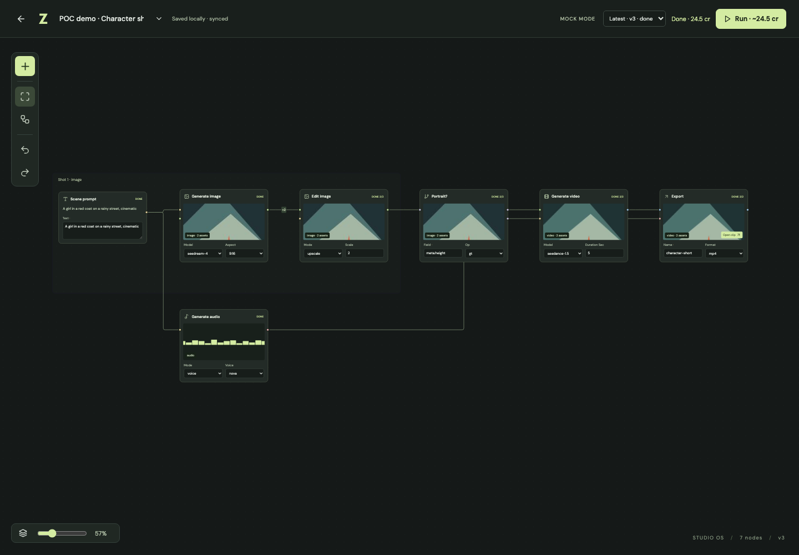
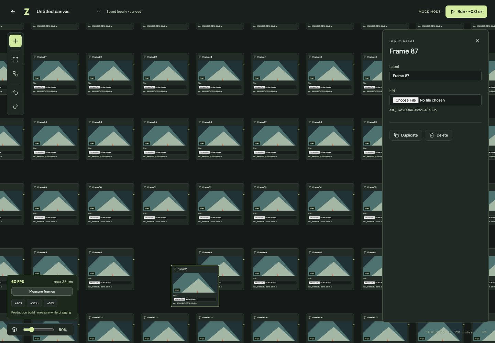
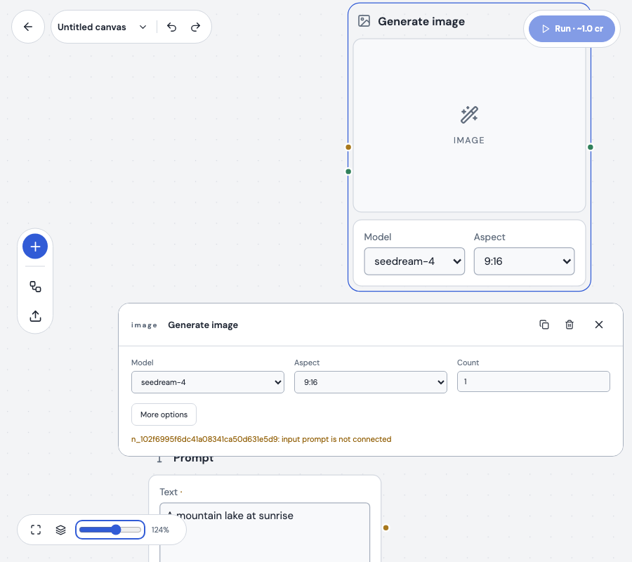
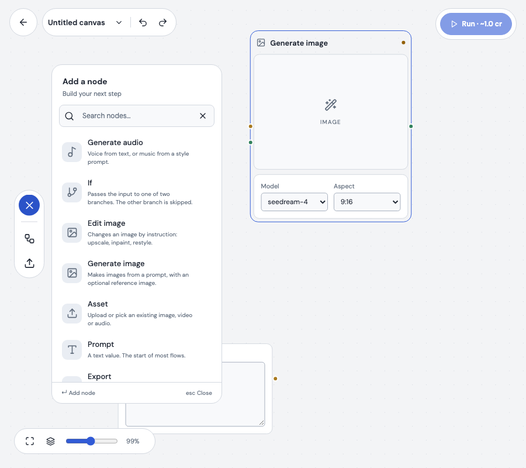

# POC verification

Initial POC baseline verified on 29 September 2026. Scope: end-to-end mock POC; real providers deferred by the user.

## v0.1.0 release verification — 30 September 2026

The integrated motion and connection UX passed typecheck, production build, formatting,
20 contract assertions, 32 unit/integration tests and all 26 production Playwright
scenarios. Motion was merged into the init branch with an identical code tree to the
tested preview. Release preparation changes version metadata and documentation only.

All five 128-node scenarios recorded 60 FPS: magnetic hover (33.3 ms maximum frame),
drag/pan (16.8 ms), connection dragging (50.0 ms), panning with four edge signals
(33.4 ms), and dragging with helper lines (33.3 ms). The original >=50 FPS and
<100 ms maximum-frame gates are unchanged. These are local production Chromium
observations, not measurements on the 16 GB reference laptop. Frame benchmarks in
`performance.spec.ts` disable trace snapshots to avoid measurement interference;
functional tests retain failure traces.

A temporary development React Profiler confirmed five controlled selection changes
render exactly the edges whose signal activation changes, preserving the edge-array
reference. A real React Flow drag at 50% zoom published one corrected nodes batch.
Committed regression tests cover multi-node publication and the 5 screen-pixel snap
boundary at 50% zoom. Profiling instrumentation stays outside the shipped source.

Counts, sampled frame metrics and profiler/store observations are retained in
[v0.1.0-validation.json](evidence/v0.1.0-validation.json).

The following sections preserve the original POC baseline evidence.

## Automated evidence

- Supplied contract assertions: **20 pass**.
- Vitest: **17 pass** across Graph API, Hocuspocus persistence/reconnect, HTTP/WS runs, fan-out, branch skipping, failure/retry, cache, cancellation, input kinds, inline size bounds and local-origin checks.
- TypeScript: `pnpm typecheck` passes.
- Production Playwright: **5 scenarios** cover building a pilot using palette and dragged ports, playable export, preset reload, recipe JSON round-trip, offline reload and two-tab convergence, failure/retry/cancel/cache, optional `audio.sfx`, and 128 image nodes.
- Tests use actual Postgres 16, a locally built MinIO, Hocuspocus, pg-boss and ffmpeg. Only model generation is mocked.

The first verification used Node 26.8.1. Compatibility is also checked with Node 22.23.3, matching the PRD's runtime major.

## Performance observation

Production Chromium, Apple M2 Max, **32 GB RAM**, 128 image nodes with actual loaded thumbnails. The automated interaction pans repeatedly and drags a visible node after image loading has settled.

| Metric | Observation |
| --- | --- |
| Average FPS | 60 |
| Longest sampled frame | 33.3 ms |
| Frames sampled | 583 |

Raw sample: [performance-128.json](evidence/performance-128.json). The test retains its current raw result in `test-results/` on each run. These are requestAnimationFrame measurements in automated Chromium, not a claim about all hardware or sustained production load.

## Review and fixes

The primary agent performed the review sequentially, following the repository's instruction to avoid delegated reviewer execution. Reviewed graph atomicity, UI/store ownership, persistence, run cancellation and retry races, cache invalidation, worker boundaries, input validation, API shapes, test coverage and maintenance cost.

Resolved issues include nested transaction rollback, stale worker writes after cancellation, spurious terminal events after cancellation, empty JSON POST bodies, offline app-shell caching, union-kind validation, inline-value limits, worker concurrency across runs, and prompt-sensitive cache keys. Tests cover the affected paths. No known blocking implementation finding remains within the agreed mock scope.

## Acceptance still requiring people or real providers

- Thao builds the pilot unassisted in under 10 minutes and records no more than two points of confusion.
- An independent developer adds a node within an hour. The included extension demonstrates the mechanism but is not that independent test.
- Repeat the production FPS interaction on the reference **16 GB laptop**.
- Choose and integrate real image/edit/video/audio providers, then validate the real 10–15-second media result.

## Local operational check

Use `/health`, the API/runner terminal output, and the run selector. Healthy behavior: jobs move to a terminal state, cancellation remains terminal, retry preserves upstream job IDs, and a repeated recipe has zero mock model charges. Search `runs`, `jobs`, `run_events` and `usage` by run ID when diagnosing an issue. For the first manual pilot session, Thao owns the usability check; stop a problematic run with Cancel and restart the local processes if needed. Do not remove Docker volumes to reset a process.

### Reference layout update — 2026-09-29

The light theme now uses floating navigation and run controls, a left node palette,
larger media previews, curved connections, and an editor anchored 16 px from the
selected node, always beneath it. Its horizontal layout puts multiline content first
and configuration fields in a wrapping row. The editor follows dragging and pan/zoom
at a readable size, clamps horizontally at viewport edges, and hides with offscreen
nodes. Opening it can pan just enough to reveal the panel; subsequent pan/drag stays
under user control. The space above the node is reserved for a future local-edit
bar. Preview images use `object-fit: contain`.

Validation: production build and TypeScript checks passed. Four browser tests
passed, including editing, selection changes, dragging, panning, zooming, edge
placement, offscreen hiding/recovery, and palette keyboard dismissal at 900 × 800. The optional `audio.sfx` test was excluded from the final run because
the running preview's registry has its eight default types and does not enable
`ENABLE_SFX_EXAMPLE`.

